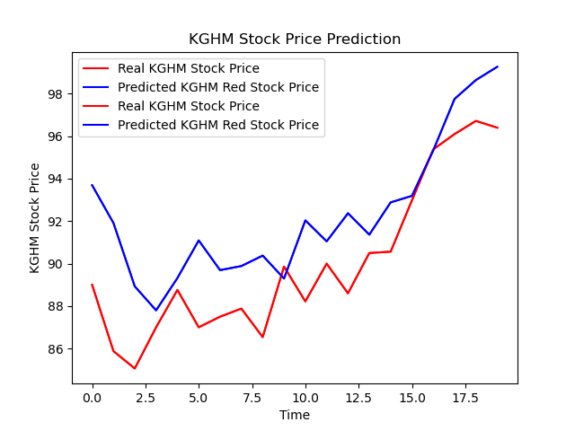

# Recurrent-Neural-Network-Stock-Price-Prediction
Usage of Recurrent Neural Network model to predict stock price

### RNN
RNN analyse and predict stock price of on KGHM noted on [Warsaw Stock Exchange](https://www.gpw.pl/en-home)

### Data Set
Data set contains price from July 10th 1997 to July 9th 2020. 
Dataset was downloaded from [Stooq](https://stooq.pl/)

### Results

### Learning Process

    Epoch 1/100
    2020-07-09 17:49:22.151689: I tensorflow/stream_executor/platform/default/dso_loader.cc:44] Successfully opened dynamic library libcublas.so.10
    2020-07-09 17:49:25.002756: I tensorflow/stream_executor/platform/default/dso_loader.cc:44] Successfully opened dynamic library libcudnn.so.7
    178/178 [==============================] - 6s 32ms/step - loss: 0.0071
    Epoch 2/100
    178/178 [==============================] - 5s 29ms/step - loss: 0.0029
    Epoch 3/100
    178/178 [==============================] - 5s 29ms/step - loss: 0.0025
    Epoch 4/100
    178/178 [==============================] - 5s 29ms/step - loss: 0.0023
    Epoch 5/100
    178/178 [==============================] - 5s 28ms/step - loss: 0.0020
    Epoch 6/100
    178/178 [==============================] - 6s 34ms/step - loss: 0.0019
    Epoch 7/100
    178/178 [==============================] - 6s 33ms/step - loss: 0.0017
    Epoch 8/100
    178/178 [==============================] - 5s 30ms/step - loss: 0.0017
    Epoch 9/100
    178/178 [==============================] - 6s 31ms/step - loss: 0.0016
    Epoch 10/100
    178/178 [==============================] - 6s 32ms/step - loss: 0.0014
    Epoch 11/100
    178/178 [==============================] - 6s 35ms/step - loss: 0.0014
    Epoch 12/100
    178/178 [==============================] - 6s 35ms/step - loss: 0.0013
    Epoch 13/100
    178/178 [==============================] - 6s 32ms/step - loss: 0.0013
    Epoch 14/100
    178/178 [==============================] - 5s 29ms/step - loss: 0.0012
    Epoch 15/100
    178/178 [==============================] - 5s 30ms/step - loss: 0.0012
    Epoch 16/100
    178/178 [==============================] - 6s 34ms/step - loss: 0.0012
    Epoch 17/100
    178/178 [==============================] - 6s 32ms/step - loss: 0.0011
    Epoch 18/100
    178/178 [==============================] - 5s 30ms/step - loss: 0.0011
    Epoch 19/100
    178/178 [==============================] - 5s 30ms/step - loss: 0.0011
    Epoch 20/100
    178/178 [==============================] - 6s 32ms/step - loss: 0.0011
    Epoch 21/100
    178/178 [==============================] - 5s 30ms/step - loss: 0.0010
    Epoch 22/100
    178/178 [==============================] - 6s 32ms/step - loss: 0.0010
    Epoch 23/100
    178/178 [==============================] - 6s 31ms/step - loss: 0.0011
    Epoch 24/100
    178/178 [==============================] - 7s 42ms/step - loss: 0.0010
    Epoch 25/100
    178/178 [==============================] - 6s 34ms/step - loss: 9.5003e-04
    Epoch 26/100
    178/178 [==============================] - 6s 32ms/step - loss: 0.0010
    Epoch 27/100
    178/178 [==============================] - 5s 30ms/step - loss: 9.7753e-04
    Epoch 28/100
    178/178 [==============================] - 5s 31ms/step - loss: 8.9504e-04
    Epoch 29/100
    178/178 [==============================] - 5s 30ms/step - loss: 9.9798e-04
    Epoch 30/100
    178/178 [==============================] - 6s 32ms/step - loss: 9.3949e-04
    Epoch 31/100
    178/178 [==============================] - 6s 31ms/step - loss: 8.8477e-04
    Epoch 32/100
    178/178 [==============================] - 5s 30ms/step - loss: 9.0162e-04
    Epoch 33/100
    178/178 [==============================] - 5s 30ms/step - loss: 9.0015e-04
    Epoch 34/100
    178/178 [==============================] - 6s 34ms/step - loss: 9.5659e-04
    Epoch 35/100
    178/178 [==============================] - 6s 36ms/step - loss: 8.7666e-04
    Epoch 36/100
    178/178 [==============================] - 6s 31ms/step - loss: 8.6098e-04
    Epoch 37/100
    178/178 [==============================] - 6s 35ms/step - loss: 8.6454e-04
    Epoch 38/100
    178/178 [==============================] - 6s 36ms/step - loss: 8.4923e-04
    Epoch 39/100
    178/178 [==============================] - 6s 32ms/step - loss: 9.0390e-04
    Epoch 40/100
    178/178 [==============================] - 6s 32ms/step - loss: 9.1576e-04
    Epoch 41/100
    178/178 [==============================] - 6s 35ms/step - loss: 8.9408e-04
    Epoch 42/100
    178/178 [==============================] - 6s 34ms/step - loss: 8.1027e-04
    Epoch 43/100
    178/178 [==============================] - 6s 31ms/step - loss: 8.1670e-04
    Epoch 44/100
    178/178 [==============================] - 6s 33ms/step - loss: 8.2235e-04
    Epoch 45/100
    178/178 [==============================] - 5s 31ms/step - loss: 8.0415e-04
    Epoch 46/100
    178/178 [==============================] - 6s 33ms/step - loss: 8.3723e-04
    Epoch 47/100
    178/178 [==============================] - 6s 33ms/step - loss: 8.3337e-04
    Epoch 48/100
    178/178 [==============================] - 6s 34ms/step - loss: 7.8877e-04
    Epoch 49/100
    178/178 [==============================] - 6s 31ms/step - loss: 8.0472e-04
    Epoch 50/100
    178/178 [==============================] - 6s 35ms/step - loss: 8.2169e-04
    Epoch 51/100
    178/178 [==============================] - 7s 39ms/step - loss: 7.5086e-04
    Epoch 52/100
    178/178 [==============================] - 6s 34ms/step - loss: 7.9042e-04
    Epoch 53/100
    178/178 [==============================] - 6s 34ms/step - loss: 7.4746e-04
    Epoch 54/100
    178/178 [==============================] - 6s 36ms/step - loss: 7.5873e-04
    Epoch 55/100
    178/178 [==============================] - 6s 32ms/step - loss: 7.9547e-04
    Epoch 56/100
    178/178 [==============================] - 6s 32ms/step - loss: 7.6060e-04
    Epoch 57/100
    178/178 [==============================] - 7s 37ms/step - loss: 7.6586e-04
    Epoch 58/100
    178/178 [==============================] - 6s 32ms/step - loss: 7.7706e-04
    Epoch 59/100
    178/178 [==============================] - 5s 29ms/step - loss: 7.0352e-04
    Epoch 60/100
    178/178 [==============================] - 5s 28ms/step - loss: 7.1768e-04
    Epoch 61/100
    178/178 [==============================] - 5s 30ms/step - loss: 7.9091e-04
    Epoch 62/100
    178/178 [==============================] - 5s 31ms/step - loss: 7.4905e-04
    Epoch 63/100
    178/178 [==============================] - 6s 33ms/step - loss: 7.7749e-04
    Epoch 64/100
    178/178 [==============================] - 5s 30ms/step - loss: 7.0482e-04
    Epoch 65/100
    178/178 [==============================] - 5s 29ms/step - loss: 7.3871e-04
    Epoch 66/100
    178/178 [==============================] - 5s 28ms/step - loss: 7.3718e-04
    Epoch 67/100
    178/178 [==============================] - 5s 28ms/step - loss: 7.5269e-04
    Epoch 68/100
    178/178 [==============================] - 5s 28ms/step - loss: 7.3225e-04
    Epoch 69/100
    178/178 [==============================] - 5s 28ms/step - loss: 7.2710e-04
    Epoch 70/100
    178/178 [==============================] - 5s 28ms/step - loss: 7.5221e-04
    Epoch 71/100
    178/178 [==============================] - 6s 31ms/step - loss: 7.0896e-04
    Epoch 72/100
    178/178 [==============================] - 7s 38ms/step - loss: 7.5398e-04
    Epoch 73/100
    178/178 [==============================] - 6s 31ms/step - loss: 7.4620e-04
    Epoch 74/100
    178/178 [==============================] - 5s 28ms/step - loss: 6.8277e-04
    Epoch 75/100
    178/178 [==============================] - 5s 29ms/step - loss: 7.2407e-04
    Epoch 76/100
    178/178 [==============================] - 5s 30ms/step - loss: 7.0960e-04
    Epoch 77/100
    178/178 [==============================] - 6s 33ms/step - loss: 7.0304e-04
    Epoch 78/100
    178/178 [==============================] - 5s 27ms/step - loss: 6.9358e-04
    Epoch 79/100
    178/178 [==============================] - 5s 26ms/step - loss: 7.0355e-04
    Epoch 80/100
    178/178 [==============================] - 5s 26ms/step - loss: 6.9969e-04
    Epoch 81/100
    178/178 [==============================] - 5s 26ms/step - loss: 6.9526e-04
    Epoch 82/100
    178/178 [==============================] - 5s 26ms/step - loss: 6.4359e-04
    Epoch 83/100
    178/178 [==============================] - 5s 26ms/step - loss: 6.7492e-04
    Epoch 84/100
    178/178 [==============================] - 5s 26ms/step - loss: 6.8222e-04
    Epoch 85/100
    178/178 [==============================] - 5s 26ms/step - loss: 6.7714e-04
    Epoch 86/100
    178/178 [==============================] - 5s 26ms/step - loss: 7.0176e-04
    Epoch 87/100
    178/178 [==============================] - 5s 25ms/step - loss: 6.5656e-04
    Epoch 88/100
    178/178 [==============================] - 5s 26ms/step - loss: 6.8158e-04
    Epoch 89/100
    178/178 [==============================] - 5s 26ms/step - loss: 7.0948e-04
    Epoch 90/100
    178/178 [==============================] - 5s 26ms/step - loss: 6.6203e-04
    Epoch 91/100
    178/178 [==============================] - 5s 26ms/step - loss: 7.0919e-04
    Epoch 92/100
    178/178 [==============================] - 5s 27ms/step - loss: 6.7563e-04
    Epoch 93/100
    178/178 [==============================] - 5s 31ms/step - loss: 7.3023e-04
    Epoch 94/100
    178/178 [==============================] - 6s 34ms/step - loss: 6.8300e-04
    Epoch 95/100
    178/178 [==============================] - 6s 33ms/step - loss: 6.5344e-04
    Epoch 96/100
    178/178 [==============================] - 6s 33ms/step - loss: 6.6447e-04
    Epoch 97/100
    178/178 [==============================] - 6s 32ms/step - loss: 6.9043e-04
    Epoch 98/100
    178/178 [==============================] - 6s 32ms/step - loss: 6.8057e-04
    Epoch 99/100
    178/178 [==============================] - 6s 32ms/step - loss: 6.7749e-04
    Epoch 100/100
    178/178 [==============================] - 6s 32ms/step - loss: 7.0244e-04